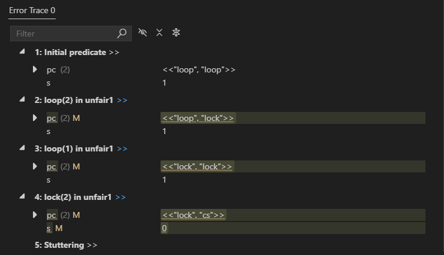
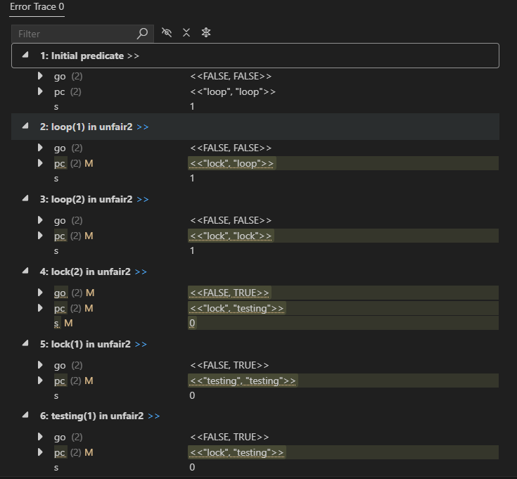
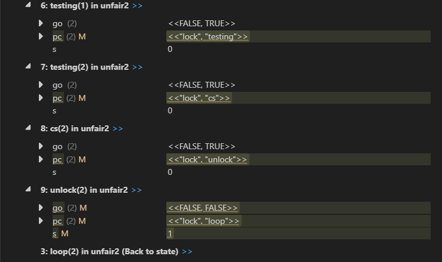
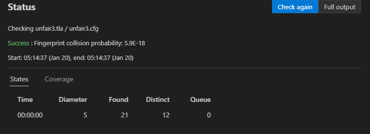
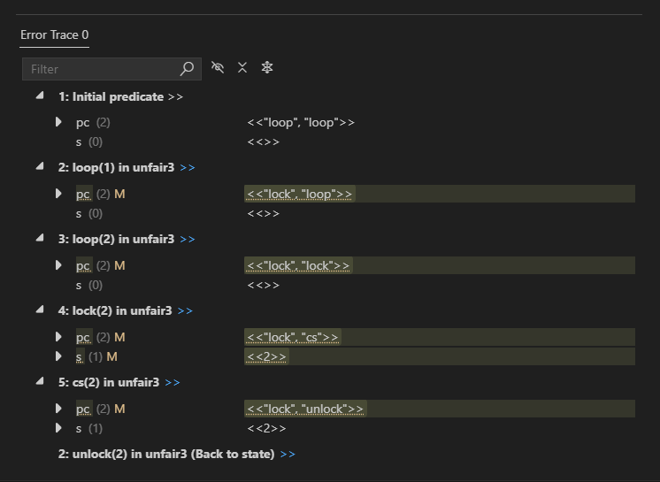
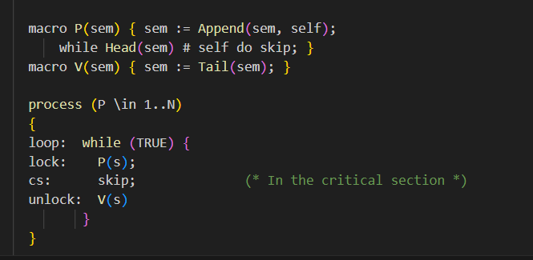

# Model Checking Questions Project  (IF311 - Formal design of software)

## Members:

    BOUHAJA Mohammed, Angelina Miller.

## Unfair semaphore

### 1-Model-check the following PlusCal model, and explain why it does not satisfy the liveness property `NoStarvation` without fairness hypothesis.

Without: (* PlusCal options (-sf) *) Error: 1 error

with: (* PlusCal options (-sf) *) Success : Fingerprint collision probability: 5.9E-18

Without fairness: The scheduler might never choose a particular process that is waiting to enter the critical section. This means a process can be starved.

NoStarvation fails: Because the property requires that every process that asks Lock eventually enters the critical sectipn, but without fairness some processes might be ignored.

### 2-Is `NoStarvation` satisfied under weak fairness assumptions? Justify.

Using (* PlusCal options (-wf) *) Errors : 1 error(s)

Under weak fairness, the "lock" action may be repeatedly interrupted and never remain continuously enabled for a waiting process, even if a process continually requests access, weak fairness does not guarantee that the process will eventually enter its critical section. Therefore NoStarvation is not satisfied under weak fairness assumptions.

### 3-Is the property `NoStarvation` satisfied under strong fairness assumptions? Justify.

Using : (* PlusCal options (-sf) *) Success : Fingerprint collision probability: 5.9E-18

Strong fairness would be needed to guarantee that if an action is enabled infinitely often (even if not continuously) it eventually occurs.

## Another unfair semaphore

### 1-Explain why the model below does not guarantee requirement `NoStarvation`, even under strong fairness hypothesis.

Using model checking: 1 error(s)

A process might keep trying to enter the critical section but never succeed. It keeps going through the "lock" and "testing" steps, but the signal that allows it to enter "go " can be cancelled or changed by another process. So even if every step is given a fair chance to run, the process may still not reach the critical section, which could cause starvation.

## An unfair semaphore once again

### 1-Define the macros `P` and `V` in the algorithm below, with the semaphore implemented as a FIFO queue of blocked processes, using TLA+ sequences.

**As a reminder:**
- `<<>>` is the empty sequence,
- `Append(s, e)` returns the sequence obtained by adding `e` to the tail of sequence `s`,
- `Head(s)` returns the head of non-empty sequence `s`,
- `Tail(s)` returns the tail of non-empty sequence `s`,
- `Len(s)` returns the length of sequence `s`.

See file unfair3.tla

### 2-Explain why your model satisfies property `NoStarvation` under strong fairness assumption, but not under weak fairness assumption.

Success : Fingerprint collision probability: 5.9E-18

Under strong fairness: when a process p waits and becomes the first in line (when head(p)=sem) , even if this condition is not satisfied all the time, the strong fairness makes sure that if p can run many times it will run eventually, this means that once p is first it will get a turn to enter the critical section, so no process will starve.

Errors : 1 error(s)

But under weak fairness it is promised that from a certain time, a process will run infinitely often if it is continuously enabled. Theoretically  being first in the line might only happen sometimes, but not continuously. Because of this, there is a chance that p might not run. This can cause starvation.

## Fair semaphore

### 1-Fix the implementation above in order to obtain an implementation that satisfies all requirements under weak fairness assumption.

The added fairness condition now guarantees, that no process will stave, even under weak fairness conditions.

